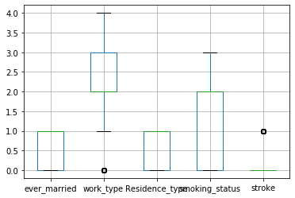

# Stroke-dataset-Analysis
Analyze the stroke dataset (https://www.kaggle.com/asaumya/healthcare-dataset-stroke-data)

1. Dataset Preview

2. Correlation Matrix
Version 1

Version 2

3. Boxplot

4. Scatter
Between BMI and Stroke

Between Age and Stroke

Between Glucose and Stroke

